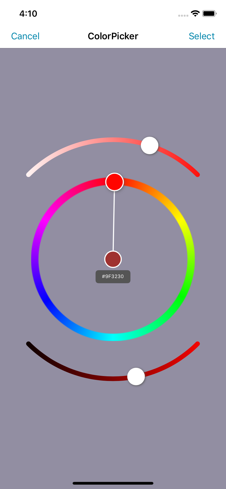
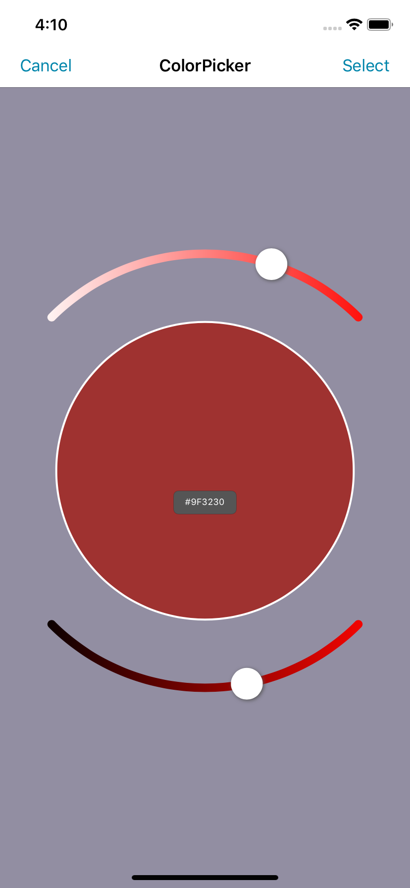
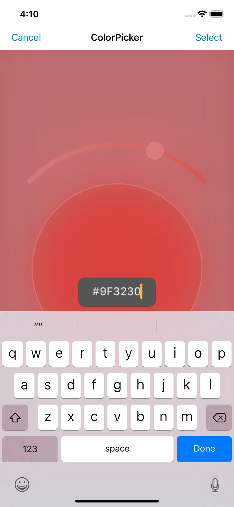

# **HSB ColorPicker iOS**

A simple and easy to use color picker based on the HSB color model.
 
 
This workspace includes the library project with the actual color picker view and a **preconfigured
view controller** embedded into a **storyboard**. The storyboard includes a text field to additional hex color code input and a **UINavigationItem**.
 
 
A premade demonstation application is also included seperately. I uses a minimally modified UINavigationController to demonstrate initiation in code and the delegate that is used to retrieve the changed color information.

# Features

- HSB color model for user input selection
- Text field for direct hex code input
- preconfigured storyboard
- iPhone support for all orientations

# Preview

  
  
  

# TODO

- iPad support (currently possible but distorted)

##

 

---

### License

MIT
